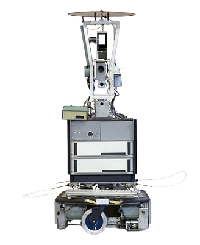
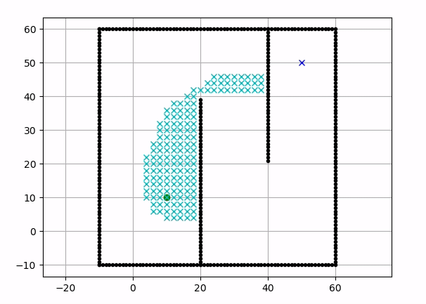
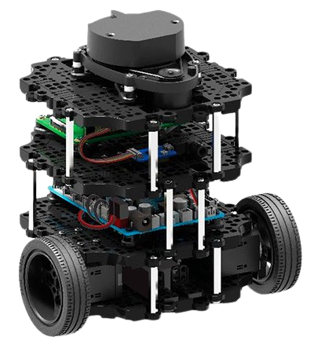
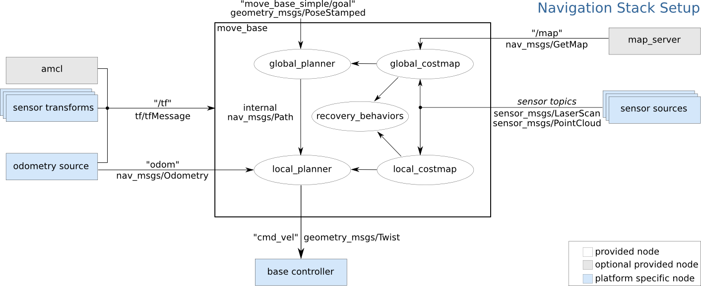
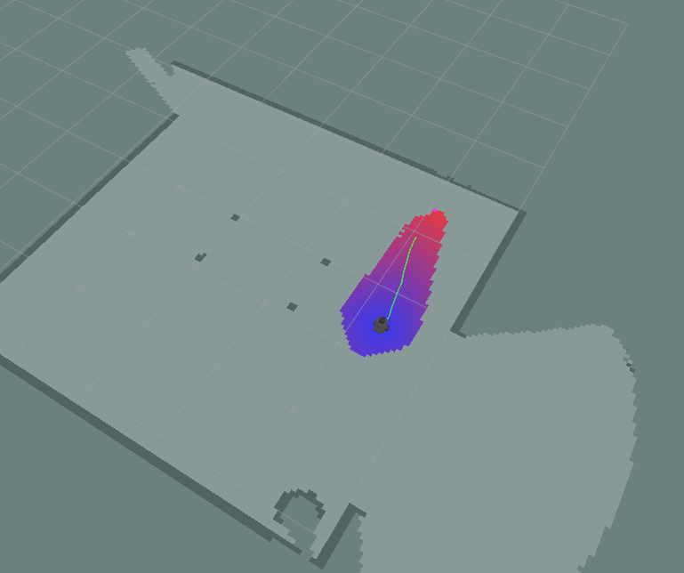
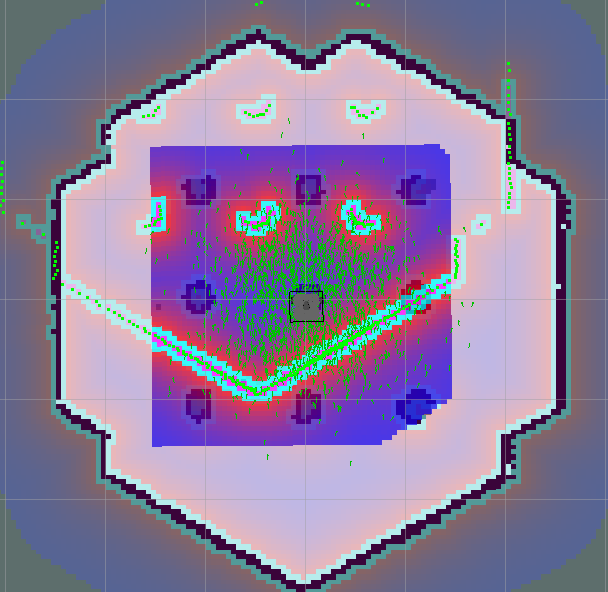
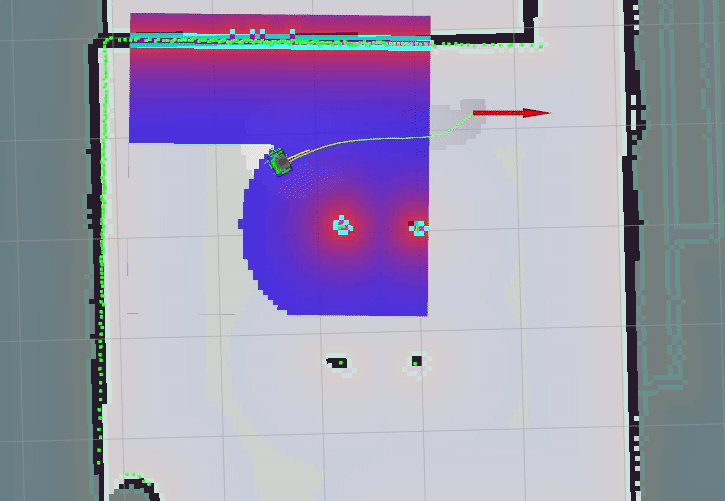

Um algoritmo de busca nada mais é do que um algoritmo que recebe um problema de busca
como entrada e retorna uma solução dentro de um conjunto de possibilidades. O algoritmo
de busca _A*_ é utilizado em vários campos da ciência da computação, podendo também ser
aplicado em problemas de busca relacionados a robótica móvel. O _A*_ foi criado como
parte de um projeto de robô móvel de propósito geral chamado _Shakey_ (1972), um dos
resultados mais notáveis do Shakey foi a utilização desse algoritmo de busca.

{:.center}

Shakey o robô

Não mais importante que o Shakey, porém relevante, o _TurtleBot3_ colheu os frutos da evolução dos algoritmos de busca
após mais da 30 anos da criação do _Shakey_! Sim, é possível utilizar o _A*_ no _TurtleBot3_.

### O algoritmo A*

O algoritmo _A*_ utiliza _grafos_ como base do sistema de busca.
O vértice inicial representa o ponto inicial em que se pretende realizar a busca
e o ponto final é o objetivo final, o algoritmo é formulado em termos de gráficos 
ponderados visando encontrar
um caminho para o objetivo dado com o menor custo (menor distância percorrida, etc.).
O algoritmo faz isso mantendo uma quantidade de caminhos originados do 
ponto inicial e expandindo esses caminhos um ponto de cada vez até que seu critério
de busca seja satisfeito.

{:.center}

### TurtleBot 3

Para realizar a navegação com _A*_ foi utilizado o modelo _Burger_ do _Turtlebot3_, ele é um robô móvel pequeno, acessível, programável
e baseado em ROS para uso em educação, pesquisa, hobby e prototipagem de produto.

{:.center}

TurtleBot3 Burger

Algumas conceitos foram importantes para o desenvolvimento da navegação, a utilização de algumas funcionalidades e pacotes específicos do
_ROS (Robot Operating System)_ foram utilizados, a seguir esse conceitos serão detalhados.

---

### Move base

O _move base_ é um pacote do ROS que, dado um objetivo no mundo, tentará alcançá-lo,
sendo que o robô parte de um ponto de referência inicial para o objetivo final. 
O nó move base vincula um planejador global e local para realizar
sua tarefa de navegação global, para esse desenvolvimento foi utilizado o planejador
global *GlobalPlanner* que irá utilizar o algoritmo _A*_, a seguir um esquema que explica
a estrutura do move base no ambiente ROS:

{:.center}

#### Utilizando o Move base com o A*

O _burger_ foi capaz de cumprir o objetivo selecionado pelo _move base_ fazendo um planejamento
de rota utilizando o _A*_! A região colorida representa o potencial desenvolvido pelo algoritmo,
a linha verde representa a rota considerada ideal para alcançar o objetivo selecionado.

{:.center}

### AMCL

_Amcl_ é um sistema de localização probabilística para um robô se movendo
em 2D. Ele implementa a abordagem de localização adaptativa
(ou amostragem KLD) de Monte Carlo (conforme descrito por Dieter Fox),
que usa um filtro de partículas para rastrear a pose de um robô em
relação a um mapa conhecido, a seguir um exemplo:

{:.center}

#### Utilizando o Move base com o AMCL e o A*

O Amcl consegue criar uma navegação mais precisa, já que a utilização de um mapa
previamente criado acrescenta mais precisão na navegação.

{:.center}

### Conclusão

A implementação do algoritmo de busca _A*_ aplicado a navegação do turtlebot
permitiu aprofundar o conhecimento sobre conceitos como algoritmos de busca, 
ROS (Robot Operating System) e navegação em robótica.

<!-- **************************************** Autor **************************************** -->

<h3 class="post-title">Autor</h3> 

  

    <table class="table-borderless highlight">
      <thead>
        <tr>
            <th>
<a href="https://www.linkedin.com/in/anderson-lima-45278b1bb/" target="_blank">
                

                    
                

            </a>
</th>
        </tr>
      </thead>
      <tbody>
        <tr class="font-weight-bolder" style="text-align: center; margin-top: 0">
          <td width="33.33%">Anderson Lima</td>
        </tr>
        <tr style="text-align: center" >
          <td style="vertical-align: top;text-align: justify;"><small>Pesquisador Júnior no laboratório de Robótica e Sistemas Autônomos (RoSA), Senai Cimatec, graduado em Engenharia Civil.</small></td>
        </tr>
      </tbody>
    </table>
  

 